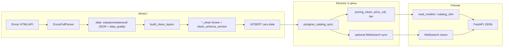

# Блок 0 — одна правда: слои данных и версии

Внутренняя страница для команды: **откуда берутся поля каталога**, **какие версии схем считать актуальными**, **где менять правила**, **какие флаги включают «чистое» чтение**. Без дублирования пошаговых runbook’ов — на них есть ссылки.

## Зачем этот документ

- Согласовать термины: **raw**, **парсер**, **`data` JSONB**, **`*_clean`**, **read model**, **индекс Meilisearch**.
- Не спорить «откуда цена»: см. раздел «Источники истины» и `PRICING_PIPELINE.md`.
- Перед изменением правил — понять, какая **константа версии** требует bump и массового пересчёта.

## Поток данных (Encar → Postgres → поиск → API)

Скрапер **не** обновляет Meilisearch напрямую: после записи в Postgres индекс поднимает отдельный job (`sync_meilisearch.py`, см. `deploy/docs/RUNBOOK_OPERATIONS.md`).

## Слои «одной карточки» в Postgres

| Слой | Где живёт | Смысл |
|------|-----------|--------|
| **Сырьё API Encar** | Внутри парсера; часть сохраняется в `data.raw_envelope` (см. парсер) | Неизменяемый контекст источника для отладки и повторного разбора. |
| **Нормализованное поле парсера** | `cars.data` (JSONB): `mark`, `model`, `my_price`, Encar-специфичные поля | То, что парсер считает «текущей моделью» карточки до каталожного синка. |
| **Качество и контракт** | `data.data_quality`, `data_quality.contract_violations`, `parser_schema_version` | Аудит (`encar_parser_audit.py`), регрессии по порогам. |
| **Clean-слой** | `identity_clean`, `spec_clean`, `pricing_clean`, …, `clean_schema_version` | Стабильные структуры для UI и расчётов; версия — `CLEAN_SCHEMA_VERSION` в `clean_layers.py`. |
| **Ценообразование каталога** | После синка: `pricing_clean` (в т.ч. tier, `final_price_rub`), колонка `cars.price_rub` | Источник истины по рублям для выдачи — контур **`postgres_catalog_sync`**, см. `PRICING_PIPELINE.md`. |
| **Read model API** | `read_models.build_*`, `catalog_slim` | То, что отдаётся клиенту; учитывает `WRA_CLEAN_READ_MODE` / процент rollout. |

## Версии и константы (bump = осознанное миграционное действие)

| Что | Константа / поле | Файл (якорь) |
|-----|------------------|--------------|
| Схема парсера Encar | `PARSER_SCHEMA_VERSION` (`encar.v2`) | `backend/parser_full.py` |
| Версия в данных карточки | `parser_schema_version` (в JSON) | Выставляется парсером |
| Clean-слой | `CLEAN_SCHEMA_VERSION` (`encar.clean.v1`) | `backend/clean_layers.py` |
| Версия clean на карточке | `clean_schema_version` | Пишется `build_clean_layers` |
| Правила tier / калькулятор Encar | `PRICING_RULES_VERSION` | `backend/catalog_encar_pricing.py` |
| Версия в `pricing_clean` | `pricing_rules_version` | Пишется синком каталога |
| Контракт API (лейбл ответа) | `WRA_API_CONTRACT_VERSION` | `backend/fastapi_app/config.py` |

При смене **`PRICING_RULES_VERSION`** — прогон синка с ценами и мониторинг очереди `needs_pricing_recompute` (см. `PRICING_PIPELINE.md`).

## Флаги runtime (чтение «clean» vs legacy)

| Переменная | Назначение |
|------------|------------|
| `WRA_CLEAN_READ_MODE` | Мастер-переключатель: предпочитать `*_clean` при сборке ответа. |
| `WRA_CLEAN_READ_PERCENT` | Постепенный rollout 0–100% (детерминированно по ключу карточки), см. `clean_mode.py`. |
| `WRA_LEGACY_FALLBACKS_ENABLED` | Разрешить откат к legacy-полям при миграции. |
| `WRA_API_CONTRACT_VERSION` | Метка контракта в ответах API. |

Последовательность rollout: `backend/docs/PRODUCT_READY_ROLLOUT.md`.

## Кто «владелец» изменений (по зонам кода)

Не имена людей — **зоны ответственности в репозитории**:

| Зона | Путь / компонент |
|------|------------------|
| Парсер Encar, raw contract | `backend/parser_full.py`, `backend/raw_json_contract.py`, `backend/scraper_pipeline/encar/` |
| Clean-слой | `backend/clean_layers.py` |
| Цены Encar, tier, очередь пересчёта | `backend/catalog_encar_pricing.py`, `backend/postgres_catalog_sync.py` |
| API и slim-каталог | `backend/fastapi_app/`, `backend/read_models.py`, `backend/catalog_pg_core.py` |
| Поиск | `infrastructure/meilisearch/sync_meilisearch.py`, preflight `backend/scripts/meili_sync_preflight.py` |
| Наблюдаемость парсера | `backend/scripts/encar_parser_audit.py`, `deploy/scripts/run_encar_parser_audit_nightly.sh` |

## Связанные документы и скрипты

- Цены и очередь: `backend/docs/PRICING_PIPELINE.md`
- Rollout clean read: `backend/docs/PRODUCT_READY_ROLLOUT.md`
- Операции (Meili, аудит, Slack): `deploy/docs/RUNBOOK_OPERATIONS.md`
- Высокоуровневая архитектура: `docs/ARCHITECTURE.md`

## Следующие блоки дорожной карты

- **Блок D** (поэтапный clean read): `backend/docs/BLOCK_D_CLEAN_ROLLOUT.md`
- **Блок A** (полный объём метрик по всем строкам) — по решению команды, после зрелости UI/данных.
